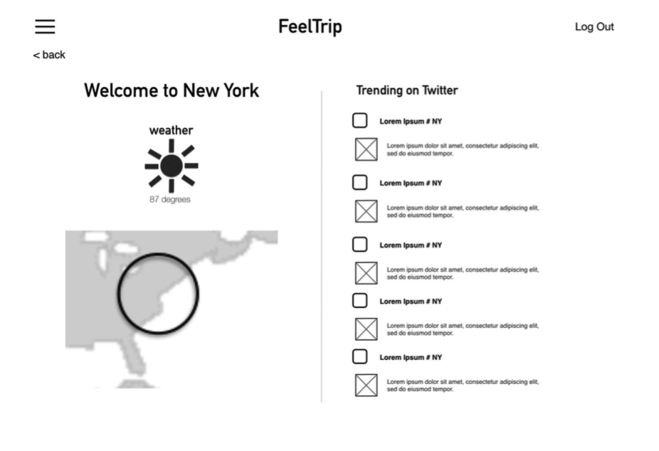
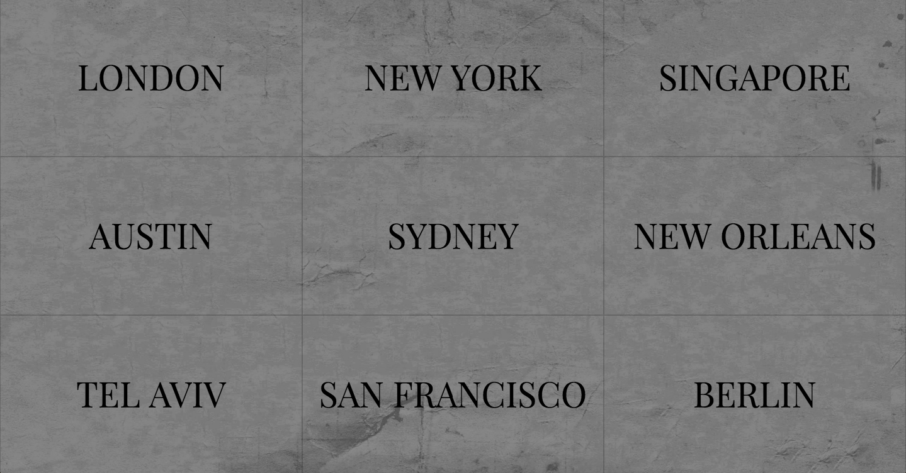
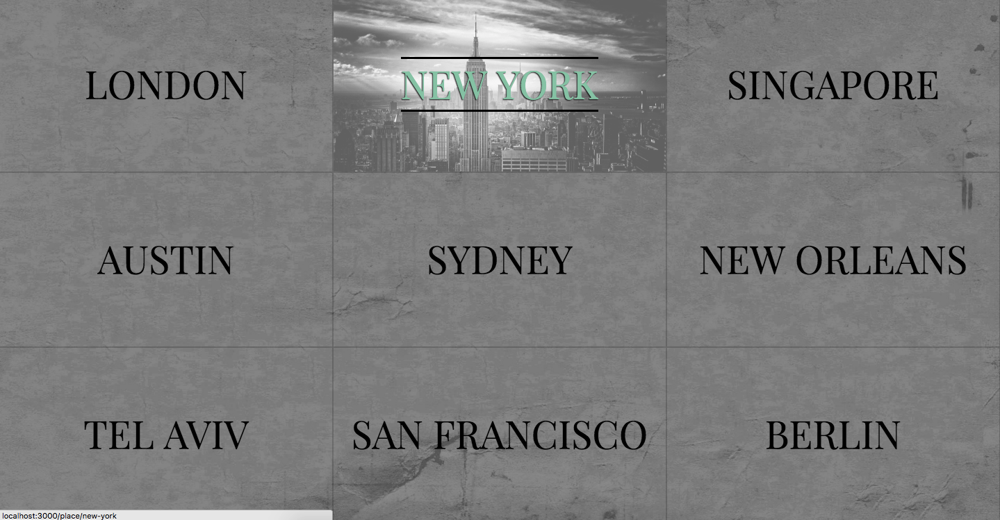
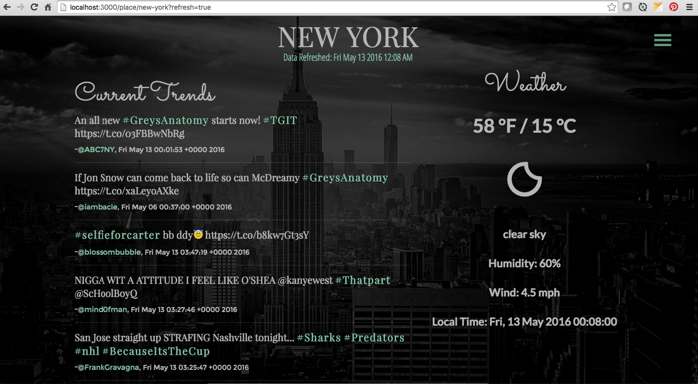

**"FEELTRIP"**

"Window to the world"

What are they tweeting about?

Curious?

Let's find out.

Let's go on a feeltrip:  

http://feeltrip.herokuapp.com/

(hosted on heroku)

 
**ABOUT**:

Do you ever wonder what people from other countries find interesting? Well, here is your chance to be up to date with the hottest, most trendy topics being sent ('tweeted') over twitter in 9 very different cities around the world. "FEELTRIP" offers you the possibility to feel the zeitgeist from a number of diverse locations. It is a constantly changing pool of tweets and trends. If you want to save the ones you like, just press the save button and they will be waiting for your next visit. Popular tweets also have links to ongoing discussion pages if you would like to know more about the subject.

**SUMMARY**:

FeelTrip is a real time content aggregator that enables users to stay connected to places beyond where they currently live. Unlike SnapChat, Twitter, Facebook, FeelTrip immerses users in the current mood of a given place, helping them either discover something new or reminisce in the now.
At FeelTrip we believe that everyone is a global citizen. We also recognize that what being a global citizen means to people is both personal and authentic. That is why ­ by launching FeelTrip ­ we aim to provide an unmanufactured, unedited experience of what it feels like to be in places we are not at for the moment.

**TECHNOLOGY**:

The site is based on the node.js, express and MongoDB stack with a JavaScript front end. It uses authentication: jwt passport for the client side browser and for the server side it uses OAUTH 2.0. The site is based on the twitter api in the back-end - it pulls data from the openweathermap api (http://openweathermap.org/) and timezonedb api (https://timezonedb.com/) via AJAX calls in the front-end.

**GENERAL APPROACH**:

This was a group project executed by 3 WDI developers (General Assembly in New York - bootcamp students - Anna, Kasia and Matt) in cooperation with a group of Project Managers (PMI students: Julie, Matt and Judd). The concept and software development took 1 week of hard work. Communication and cooperation was smooth and inspirational.

The biggest challenge in development was to generate the desired content from the twitter api. It was a great challenge as well as a valuable experience.

**USER STORIES**:

- As a user, I want to be able to easily see all of the locations in one place so that I can make an informed decision about where I want to explore.

- As a user, I want to be able to view one location at a time so that I can feel immersed in the place (detailed view).

- As a user, I want to be able to view 5 - 15 trending topics on Twitter in a given place so that i can have an idea of what people care about in that moment in time without being too overwhelmed

- As a user, I want to be able to view the current weather of a given place so that i can envision myself there at that moment.

- As a user, I want to be able to return to the main view when I am on a location’s page so that i can immerse myself in other locations with minimal effort.

- As a user, I want to be able to easily log into FeelTrip so I can access FeelTrip
  - the landing page has a clear call to action for log in
  - the log in calls for an email and password
  - a password reset option is available
  - log out is easily accessible in the top right corner from all pages

- As a user, I want to be able to save a snapshot of all of the information on location page so that I can look back on it later.

- As a user, I want a universal menu to be able to access from any page that can direct me where I want to go next.

**WIREFRAMES**:

- Wireframe:

- Login Page: 

- Main Page: 

- Main Page: active link with hover effect: 

- City Page:

- Menu buttons: 

